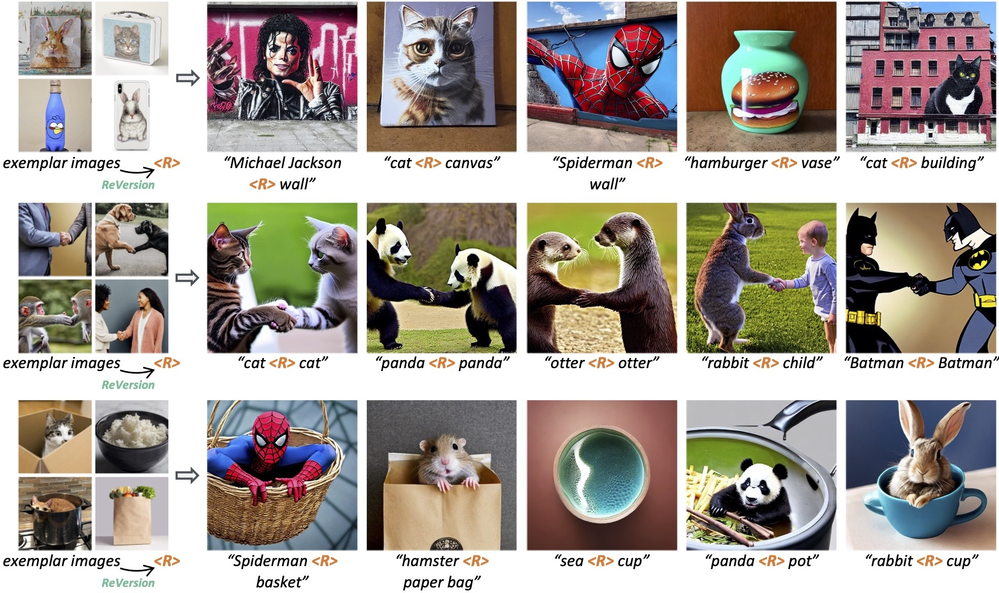

# ReVersion: Diffusion-Based Relation Inversion from Images


This repository contains the implementation of the following paper:
> **ReVersion: Diffusion-Based Relation Inversion from Images**<br>
> [Ziqi Huang](https://ziqihuangg.github.io/)<sup>∗</sup>, [Tianxing Wu](https://tianxingwu.github.io/)<sup>∗</sup>, [Yuming Jiang](https://yumingj.github.io/), [Kelvin C.K. Chan](https://ckkelvinchan.github.io/), [Ziwei Liu](https://liuziwei7.github.io/)<br>

From [MMLab@NTU](https://www.mmlab-ntu.com/) affiliated with S-Lab, Nanyang Technological University

[[Paper]()] | 
[[Project Page](https://ziqihuangg.github.io/projects/reversion.html)] | 
[[Video](https://www.youtube.com/watch?v=pkal3yjyyKQ)] |
[[Dataset (coming soon)]()]


## Overview


We propose a new task, **Relation Inversion**: Given a few exemplar images, where a relation co-exists in every image, we aim to find a relation prompt **\<R>** to capture this interaction, and apply the relation to new entities to synthesize new scenes. The above images are generated by our **ReVersion** framework.

## Updates
- [03/2023] Pretrained models with relation prompts are uploaded.
- [03/2023] Project page and video are released.
- [03/2023] Inference code released.


## Installation

1. Clone Repo

   ```bash
   git clone https://github.com/ziqihuangg/ReVersion
   cd ReVersion
   ```

2. Create Conda Environment and Install Dependencies

   ```bash
   conda create -n reversion
   conda activate reversion
   conda install python=3.8 pytorch==1.11.0 torchvision==0.12.0 cudatoolkit=11.3 -c pytorch
   pip install diffusers["torch"]
   pip install -r requirements.txt
   ```
## Usage

### Relation Inversion
Given a set of exemplar images and their entities' coarse descriptions, you can optimize a relation prompt **\<R>** to capture the co-existing relation in these images, namely *Relation Inversion*. 

The code for implementing Relation Inversion will be released soon.


### Generation
The relation prompt **\<R>** learned though Relation Inversion can be applied to generate relation-specific images with new objects, backgrounds, and style.

1. Run Relation Inversion as described in the former section on your customized data, or download the models from [here](https://drive.google.com/drive/folders/1apFk6TF3pGH00hHF1nO1S__tDlrcLQAh?usp=sharing), where we provide several pretrained relation prompts for you to play with. More relation prompts will be provided soon.

2. Put the models under `./experiments/` as follows:
    ```
    ./experiments/
    ├── painted_on
    │   ├── checkpoint-500
    │   ...
    │   └── model_index.json
    ├── carved_by
    │   ├── checkpoint-500
    │   ...
    │   └── model_index.json
    ├── inside
    │   ├── checkpoint-500
    │   ...
    │   └── model_index.json
    ...
    ```
    <!-- ```
    ./experiments/
    ├── painted_on
    │   ├── annotations
    │   |   ├── train.csv
    │   |   ├── test.csv
    │   |   └── val.csv
    │   └── images
    │       ├── train
    │       │   ├── Bangs-Eyeglasses-Smiling-Young
    │       │   |   ├── xxxxxx.jpg
    |       |   |   ...
    |       |   |   └── xxxxxx.jpg
    |       |   ...
    │       │   ├── Young-Smiling-Eyeglasses
    │       │   |   ├── xxxxxx.jpg
    |       |   |   ...
    |       |   |   └── xxxxxx.jpg
    │       │   └── original
    │       │       ├── xxxxxx.jpg
    |       |       ...
    |       |       └── xxxxxx.jpg
    │       ├── test
    │       │   % the same structure as in train
    │       └── val
    │           % the same structure as in train
    └── facial_components
    ``` -->

<!-- 3. Run the following script (an example):
    ```
    python inference.py \
    --model_id ./experiments/painted_on \
    --prompt "cat <R> stone" \
    --template_name painted_on_examples \
    --placeholder_string "<R>" \
    --num_samples 10 \
    --guidance_scale 7.5
    ```
    Where `model_id` is the model directory, `num_samples` is the  -->
    
3. Take the relation `painted_on` for example, you can either use the following script to generate images using a single prompt, *e.g.*, "cat \<R> stone":
    ```
    python inference.py \
    --model_id ./experiments/painted_on \
    --prompt "cat <R> stone" \
    --placeholder_string "<R>" \
    --num_samples 10 \
    --guidance_scale 7.5
    ```
    Or write a batch of template prompts in `./templates/templates.py` and generate a batch of images using your specified `template_name` with:
    ```
    python inference.py \
    --model_id ./experiments/painted_on \
    --template_name $your_template_name \
    --placeholder_string "<R>" \
    --num_samples 10 \
    --guidance_scale 7.5
    ```
    Where  `model_id` is the model directory, `num_samples` is the number of images to generate for each prompt, `guidance_scale` is the classifier-free guidance scale.

    We provide several example templates for each relation in `./templates/templates.py`, such as `painted_on_examples`, `carved_by_examples`, etc.

    The generation results will be saved in the `inference` folder in each model's directory.

### Diverse Generation
You can also specify diverse prompts with the relation prompt **\<R>** to generate images of diverse backgrounds and style. For example, your prompt could be "michael jackson \<R> wall, in the desert", "cat \<R> stone, on the beach", etc. We list some sample results as follows.


## Citation

   If you find our repo useful for your research, please consider citing our paper:

   ```bibtex
   @article{huang2023reversion,
        title={{ReVersion}: Diffusion-Based Relation Inversion from Images},
        author={Huang, Ziqi and Wu, Tianxing and Jiang, Yuming and Chan, Kelvin C.K. and Liu, Ziwei},
        journal={arXiv preprint},
        year={2023}
    }
   ```


## Acknowledgement

The codebase is maintained by [Ziqi Huang](https://ziqihuangg.github.io/) and [Tianxing Wu](https://tianxingwu.github.io/).

This project is built using the following open source repositories:
- [Stable Diffusion v1-5](https://huggingface.co/runwayml/stable-diffusion-v1-5)
- [Diffusers](https://github.com/huggingface/diffusers)